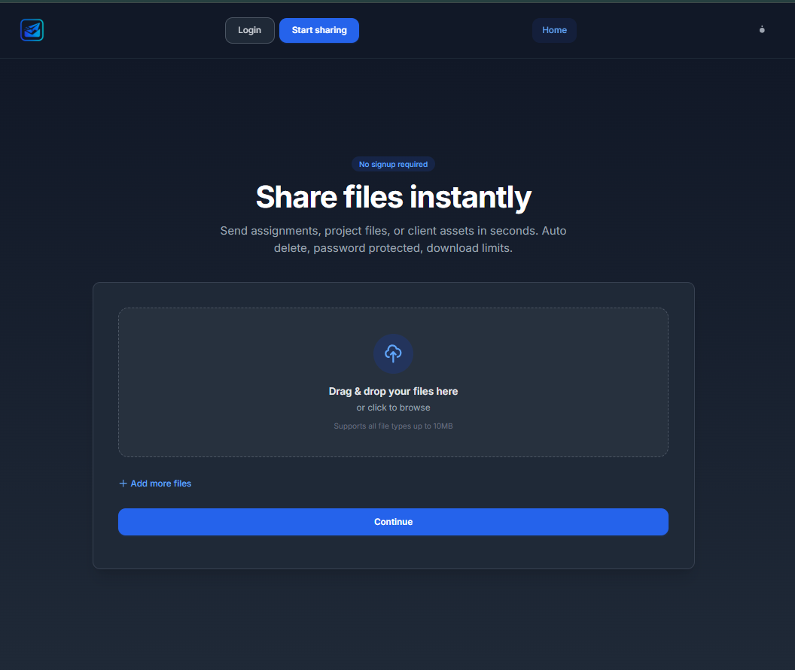
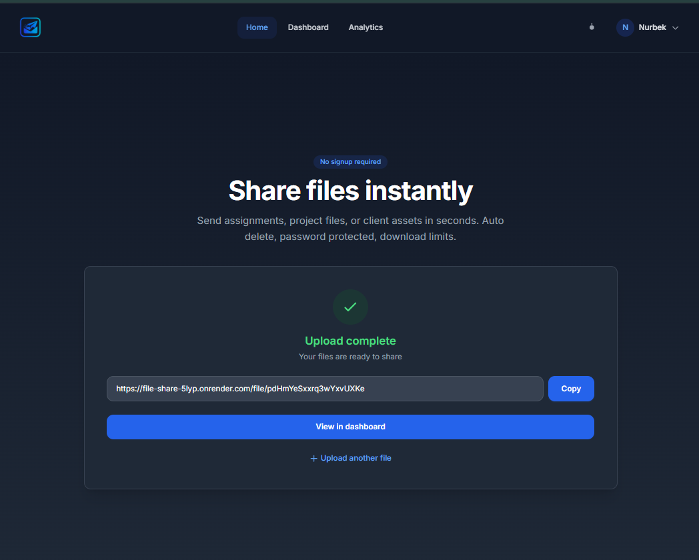
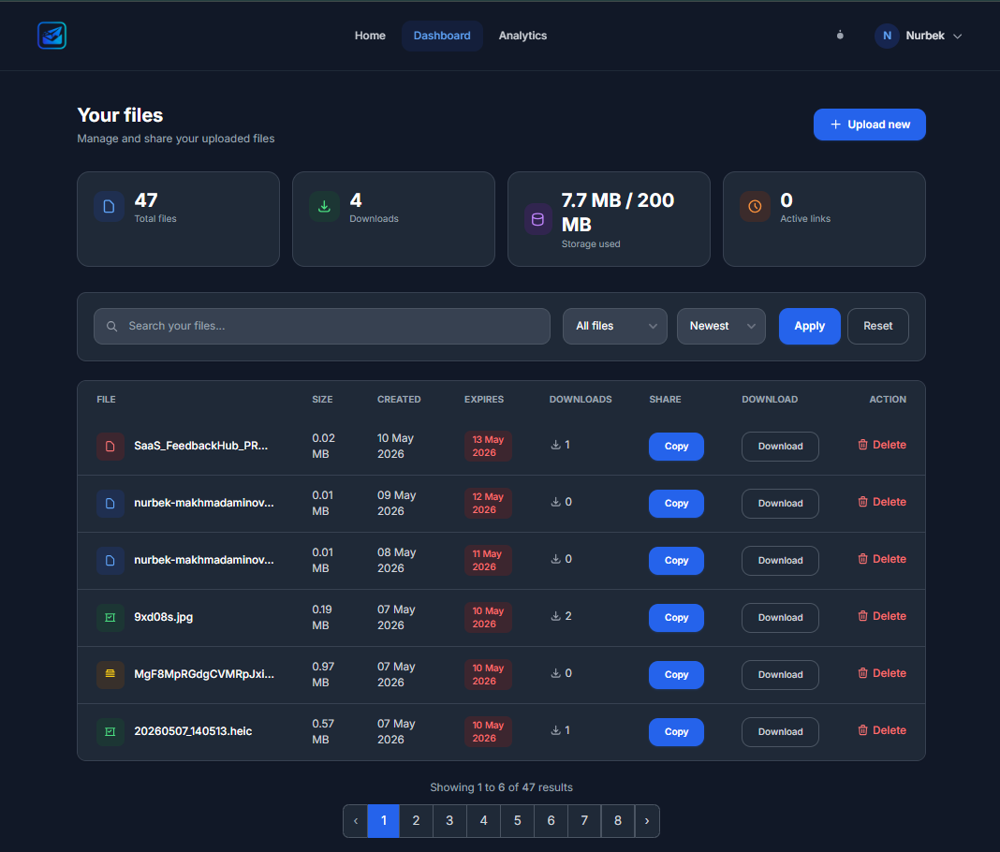

# WSend

A modern file-sharing platform built with Laravel.  
WSend allows users to upload, manage, and share files through a clean and responsive interface.

## Live Demo

🔗 https://file-share-5lyp.onrender.com/
---

## Overview

WSend is a lightweight SaaS-style application focused on fast and simple file sharing. Users can upload files, generate shareable links, and manage everything from a modern dashboard optimized for both desktop and mobile devices.

---

## Features

- Secure file uploads
- Public file sharing
- Unique shareable links
- File management dashboard
- Authentication system
- Responsive mobile-friendly UI
- Clean and modern design
- Fast upload and sharing workflow

---

## Tech Stack

### Backend
- PHP
- Laravel

### Frontend
- Tailwind CSS
- Alpine.js
- Blade Templates

### Database
- MySQL

---

## Screenshots

### Upload Page


### Share Link Page


### Dashboard


---

## Installation

Clone the repository:

```bash
git clone https://github.com/Nurbekprodev/wsend.git
```

Move into the project directory:

```bash
cd wsend
```

Install dependencies:

```bash
composer install
npm install
```

Create the environment file:

```bash
cp .env.example .env
```

Generate the application key:

```bash
php artisan key:generate
```

Configure your database credentials inside the `.env` file.

Run migrations:

```bash
php artisan migrate
```

Start the development server:

```bash
php artisan serve
```

Run Vite:

```bash
npm run dev
```

---

## Environment Variables

Example configuration:

```env
APP_NAME=WSend
APP_ENV=local
APP_KEY=
APP_DEBUG=true
APP_URL=http://localhost

DB_CONNECTION=mysql
DB_HOST=127.0.0.1
DB_PORT=3306
DB_DATABASE=wsend
DB_USERNAME=root
DB_PASSWORD=
```

---

## Usage

1. Register or log into your account
2. Upload a file
3. Generate a shareable link
4. Share the link with others
5. Manage uploaded files from the dashboard

---

## Project Structure

```text
app/
bootstrap/
config/
database/
public/
resources/
routes/
storage/
tests/
```

---

## Future Improvements

- Drag and drop uploads
- File expiration settings
- Cloud storage integration
- Team collaboration
- Multi-language support
- File analytics

---

## Contributing

Contributions, issues, and feature requests are welcome.

Feel free to fork the repository and submit a pull request.

---

## License

This project is licensed under the MIT License.

---

## Author

Developed by Nurbek Makhmadaminov.
